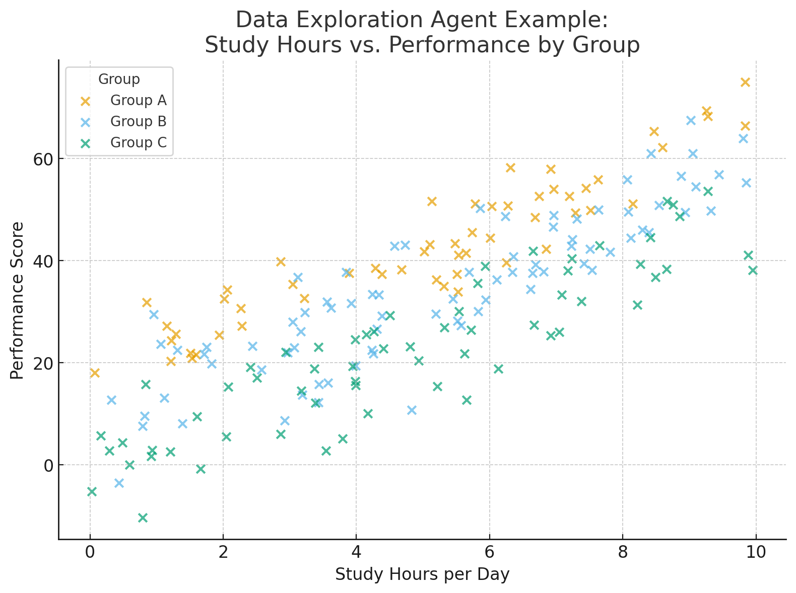
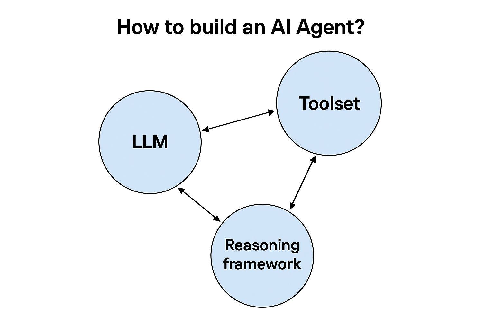
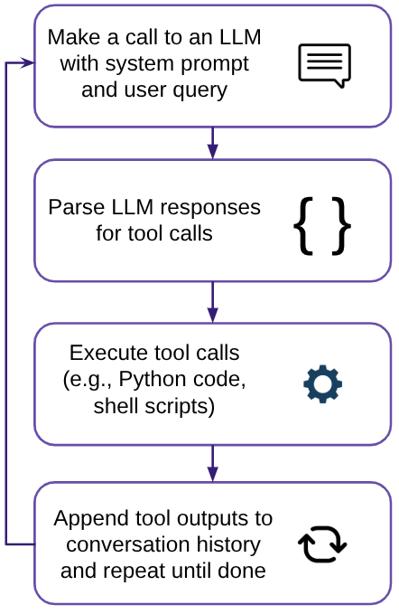
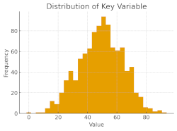
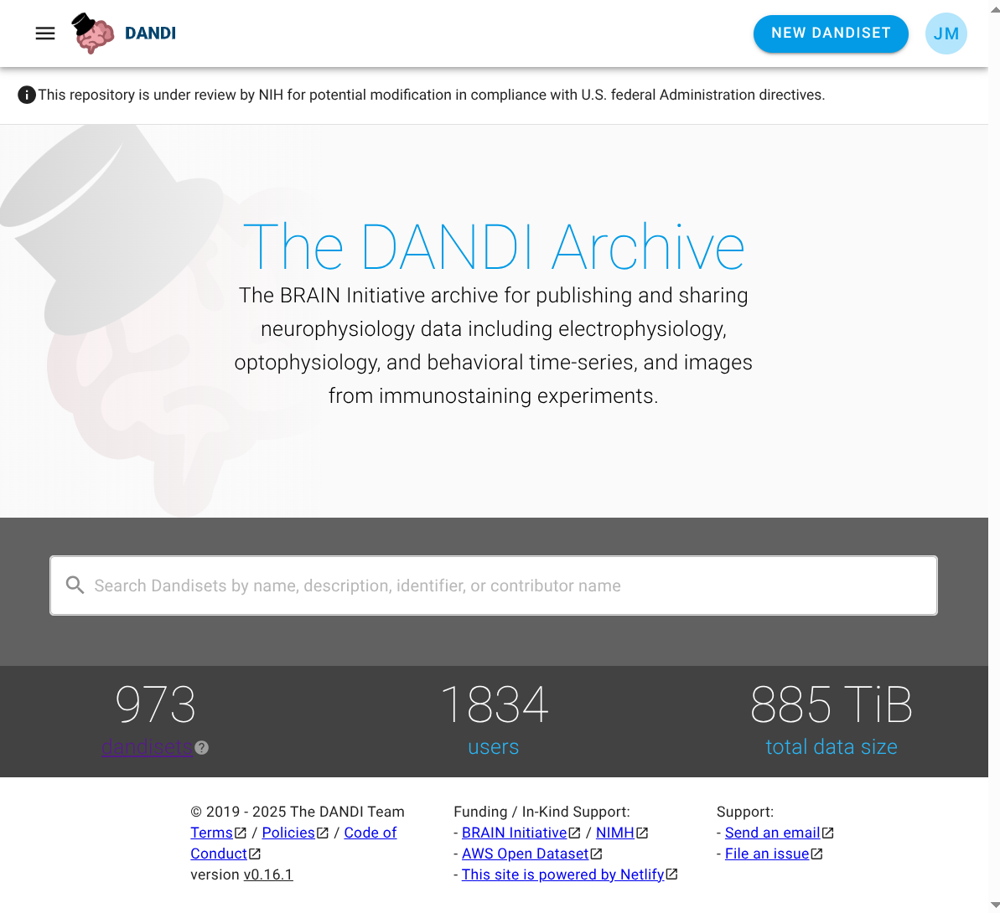
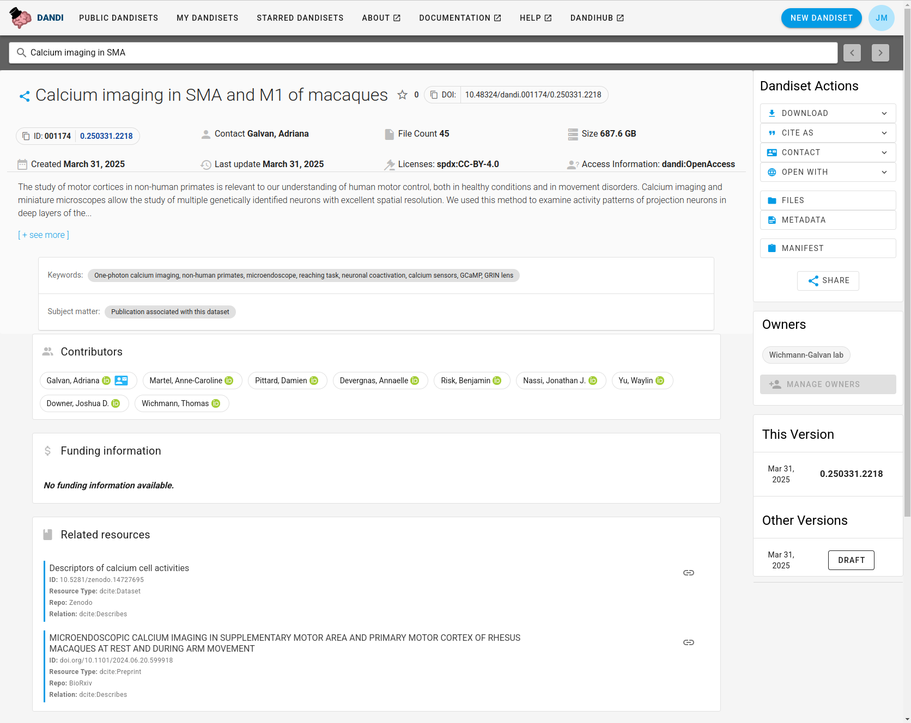
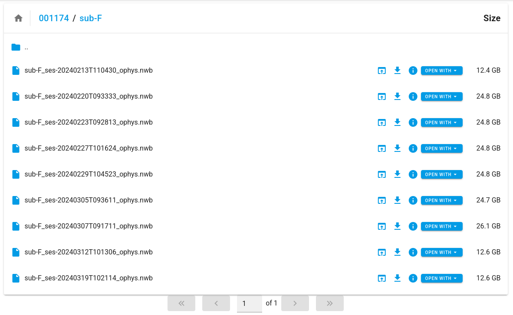
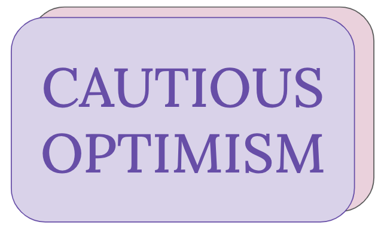

# AI Agents for Data Science: How To and Should We?

slide-type <- title

subtitle <- Flatiron-Wide Autumn Meeting, October 2025

author <- Jeremy Magland, Center for Computational Mathematics, Flatiron Institute

---

# Outline

font <- large

* What are AI agents?
* Why use them? Why be cautious?
* How to build an AI agent?
* Application: Stan Assistant
* Application: Exploring the DANDI Archive (public neurophysiology data)
* What could possibly go wrong?
* Spurious discovery tests
* What's next?

---

# What is a Software Agent?

A software agent is a system that can:
* Perceive environment
* Reason about goals
* Act autonomously (or semi-autonomously)

**Example: Thermostat**
* Perceives temperature
* Has goal temperature
* Acts by turning heating/cooling on or off

section-break


---

# What is an AI Agent?

An AI agent is a software agent that uses artificial intelligence

**Example: Self-driving car**
* Perceives environment using sensors (cameras, LIDAR, etc.)
* Has goals (reach destination safely and efficiently)
* Acts by controlling the vehicle (steering, acceleration, braking)

section-break


---

# Data Exploration Agent

**Example: Visualizing a dataset**
* Perceives: Reads and summarizes a dataset (e.g., CSV file)
* Has goals: Generate informative visualizations
* Acts: Create and execute scripts to produce plots

**Reasoning loop:**
1. Load and summarize the dataset
2. Identify interesting features (e.g., distributions, correlations)
3. Decide which visualizations to create
4. Generate and execute code to create plots
5. Review results and iterate if necessary
6. Produce a final report

**Final output**: An exploratory report showing meaningful patterns discovered automatically

section-break



---

# Why use them?

### Potential benefits

* Productivity
    - Automate repetitive tasks
    - Accelerate analysis
* Discovery
    - Uncover hidden patterns
    - Generate hypotheses that a human might miss
* Accessibility
    - Make data science accessible to non-experts
    - Lower the barrier to entry

section-break


---

# Why be cautious?

### Potential risks

* Reliability concerns
    - LLMs can produce incorrect or misleading results
    - Who is ultimately responsible for the analysis?
* Ethical considerations
    - Biases in training data
    - Plagiarism and intellectual property issues
    - Environmental impact
* Over-reliance on automation
    - Risk of losing critical thinking skills
    - Implications for future generations of scientists

section-break


---

# What about ChatGPT?

ChatGPT is a specific implementation of an AI agent from OpenAI.

* Can be used for a wide range of tasks
* Can be customized with system prompts (custom GPTs)
* Can use custom tools to an extent (work in progress)

**Limitations**:
* Does not have access to your local environment
* Cannot launch code on your computer
* Limited customization possible - in tool usage, integration with other systems, output formatting, etc.

section-break


---

# How to build an AI Agent?

font <- large

**Key components:**
* LLM (e.g., GPT-4, Claude)
* Toolset (e.g., Python, shell commands, APIs)
* Reasoning framework

section-break



---

# How to build an AI Agent?

### Agent reasoning loop

1. Send system prompt and query to LLM
2. Parse response for tool calls
3. Run tools (Python, shell, etc.)
4. Add outputs to history; repeat until complete

section-break




---

# How to build an AI Agent?

font <- large

Here's the system prompt of a sample AI agent that explores a dataset and generates visualizations.

section-break

font <- medium-small

**Sample system prompt**:
You are an expert data scientist. Your task is to explore a dataset and generate visualizations. You have access to Python and common data science libraries (pandas, matplotlib, seaborn, etc.). You can also use shell commands to manage files.

In your response you can respond with the following tool calls

```xml
<tool name="execute_python">
# Python code here
</tool>

<tool name="read_file">
Path to file here
</tool>

<tool name="write_file">
Path to file here
</tool>

<tool name="execute_shell">
# Shell command here
</tool>

etc.
```

Do not hallucinate, etc., etc.

---

# Sample Conversation (Agent Reasoning Loop)

font <- small

**System prompt**: **As in previous slide**

**User**: Please analyze the dataset `data.csv` and generate visualizations.

**Assistant**: Sure! I will start by loading and summarizing the dataset.

```xml
<tool name="execute_python">
import pandas as pd
df = pd.read_csv('data.csv')
summary = df.describe()
summary.to_csv('summary.csv')
</tool>
```

**Tool response**: Executed Python code. No console output. *<-- agent must execute code and set the tool response*

**Assistant**: I have loaded the dataset and generated a summary. The summary is saved in `summary.csv`. Next, I will read the summary file.

```xml
<tool name="read_file">
summary.csv
</tool>
```

**Tool response**: (Contents of summary.csv)

**Assistant**: I have read the summary of the dataset. Next, I will generate a plot depicting the distribution of a key variable.

```xml
<tool name="execute_python">
import matplotlib.pyplot as plt
...
plt.savefig('plot.png')
```

section-break
font <- small

Tool response: Executed Python code. No console output.

**Assistant**: I have generated a plot and saved it as `plot.png`.

```xml
<tool name="end">
The analysis is complete. The summary is in `summary.csv` and the plot is in `plot.png`.
</tool>
```



---

# Accessing the LLM

slide-type <- tabs-on-right

**Options for accessing LLMs:**

* OpenAI API (e.g., GPT-4, GPT-3.5)
* Anthropic API (e.g., Claude)
* OpenRouter API (access to many models)
* Local models (e.g., LLaMA, Mistral)

API calls typically involve sending a conversation history and receiving a response.

To implement an agent, you would loop over this process, feeding tool outputs back into the LLM as new messages.

section-break

font <- small

### What does an API call look like?

tab-label <- OpenAI API

```python
import openai

response = openai.ChatCompletion.create(
    model="gpt-4",
    messages=[
        {"role": "system", "content": "You are a helpful assistant... etc."},
        {"role": "user", "content": "Please analyze the dataset `data.csv` and generate visualizations."}
    ],
    temperature=0.7
)

tool_calls = response.get("tool_calls", [])
text_response = response.get("choices", [])[0]["content"]

print("LLM response:", text_response)
if tool_calls:
    for tool_call in tool_calls:
        tool_name = tool_call["name"]
        tool_args = tool_call.get("arguments", "")
        # Execute the tool call
        print(f"Executing tool: {tool_name} with args: {tool_args}")
```

section-break

tab-label <- OpenRouter Models

./markdown_files/snapshot-table-of-openrouter-models.md

---

# Minicline: Implementation of AI agent in Python

Cline is a popular coding companion agent that integrates with VSCode. It works well for software engineering tasks, but is complex and has many dependencies, including VSCode itself.

Minicline is a simplified Python and command-line interface geared toward data science tasks.

section-break

<iframe src="https://magland.github.io/minicline/"></iframe>

---

# Application: Stan Assistant

slide-type <- tabs-on-right

[Stan](https://mc-stan.org/) is a probabilistic programming language for statistical modeling and Bayesian inference.

Stan Assistant is a web-based AI agent that helps users learn about Stan and build models.

Tools available to the agent:
* Access parts of the [Stan User's Guide](https://mc-stan.org/docs/stan-users-guide/index.html)
* Embed Stan Playground for interactive coding

Strict instructions to avoid hallucinations

(Right now you can't do these things with ChatGPT)

section-break

tab-label <- Live Chat

<iframe src="https://stan-assistant.vercel.app"></iframe>

section-break

tab-label <- Demo Video

<iframe src="https://users.flatironinstitute.org/~magland/screencasts/presentations/ai-agents-for-data-science-how-to-and-should-we/stan-assistant-demo.webm"></iframe>

section-break

tab-label <- System Prompt

./markdown_files/stan-assistant-system-prompt.md

---

# DANDI Archive

slide-type <- tabs-on-right

The DANDI Archive allows publishing and sharing neurophysiology data

* Hosts large-scale datasets
* Supports reproducible research
* Provides rich metadata and search capabilities

The tabs to the right show screenshots of the DANDI Archive website and an example dataset.

Dandiset 001174 has 45 Files, 680 GB, Neurodata Without Borders (NWB) format

**How does one get started exploring this dataset?**

section-break

tab-label <- DANDI Archive



section-break

tab-label <- Example Dataset



section-break

tab-label <- Example Dataset Files



---

# Dandiset Explorer

An AI Agent that helps scientists get started exploring a dataset

Equipped with the following tools:
* DANDI API access for retrieving metadata and file listings
* Python execution environment with common data science libraries
* Specialized usage information for NWB files

The agent can view the text and image output of executed code and can iteratively refine its analysis.

section-break

<iframe src="https://dandiset-explorer.vercel.app/chat/de_1759960923445?dandisetId=001174&dandisetVersion=draft"></iframe>

---

# What could possibly go wrong?


---

# How much should we trust the results?

We programmed the AI agents to explore the DANDI archive, autonomously analyzing datasets and generating reports.

What we found:
* Produced all kinds of fantastic notebooks and visualizations.
* Impressive at first glance.
* Deeper analysis revealed many instances of 'crappy' science.

The example to the right is a typical case. Dizzying amounts of code. Scroll to the bottom to see the conclusions. Mingled with the correct statements are many incorrect ones.

section-break

<iframe src="https://nbfiddle.app/?url=https://github.com/dandi-ai-notebooks/001363/blob/main/2025-04-18-claude-3.7-sonnet-prompt-b-5/001363.ipynb"></iframe>

---

# Spurious Discovery Tests

**Aproach**

* Generated 4 fake datasets with no real underlying signal.
* Asked AI agents to analyze them.
* Checked if they correctly found *nothing*.

**Results**

* Most agents found spurious correlations and patterns (i.e., false discoveries).
* Highlights a key risk: **AI can confidently produce false science**.

section-break

<iframe src="https://magland.github.io/spurious-discovery-tests/"></iframe>

---

# Summary

**AI Agents for Data Science**

**Opportunities**:
* Automate and acclerate data analysis
* Enable new discoveries and insights
* Lower barriers to working with data

**Challenges**:
* Reliability and trustworthiness
* Ethical and societal implications
* Risk of over-reliance on automation and bad science practices

section-break



---

# Thank You!

**Neurodata Without Borders Team**:

* Ryan Ly - Lawrence Berkeley National Laboratory
* Oliver Ruebel - Lawrence Berkeley National Laboratory
* Benjamin Dichter - CatalystNeuro

**DANDI Team**:
* Satrajit Ghosh - MIT, Harvard Medical School
* Yaroslav Halchenko - Dartmouth College
* Benjamin Dichter - CatalystNeuro

**Stan Playground Team**:
* Brian Ward - Flatiron Institute
* Jeff Soules - Flatiron Institute
