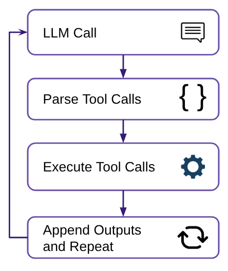

# AI Agents for Data Science: How To and Should We?

```yaml slide-metadata
slide-type: title
subtitle: Flatiron-Wide Autumn Meeting, October 2025
author: Jeremy Magland, Center for Computational Mathematics, Flatiron Institute
```

---

# Outline

```yaml section-metadata
font: large
```
* What are AI agents?
* Why use them? Why be cautious?
* How to build an AI agent?
* Application: Tool Assistant
    - Getting started using a software tool
* Application: Dataset Assistant
    - Getting started exploring a dataset
* Deeper Analysis / Hypothesis Testing
* What could possibly go wrong?
* Spurious discovery tests
* What's next?

* * *

<div style="text-align: center;">
</img>
</div>
<div style="text-align: center;">
</img>
</div>

---

# What is a Software Agent?

A software agent is a system that can:
* Perceive environment
* Reason about goals
* Act autonomously (or semi-autonomously)

**Example: Thermostat**
* Perceives temperature
* Has goal temperature
* Acts by turning heating/cooling on or off

* * *


---

# What is an AI Agent?

An AI agent is a software agent that uses artificial intelligence

**Example: Self-driving car**
* Perceives environment using sensors (cameras, LIDAR, etc.)
* Has goals (reach destination safely and efficiently)
* Acts by controlling the vehicle (steering, acceleration, braking)

* * *


---

# Data Exploration Agent

**Example: Visualizing a dataset**
* Perceives: Reads a dataset (e.g., CSV file)
* Has goals: Generate informative visualizations
* Acts: Create and execute scripts to analyze the data and produce plots

**Reasoning loop:**
1. Load and summarize the dataset
2. Identify interesting features (e.g., distributions, correlations)
3. Decide which visualizations to create
4. Generate and execute code to create plots
5. Review results and iterate if necessary
6. Produce a final report

**Final output**: An exploratory report showing meaningful patterns discovered automatically

* * *


---

# Hypothesis Testing Agent

**Hypothesis**: Higher synchrony between frontal and parietal brain regions predicts better attention performance.

**Dataset**: Thousands of neural recordings across many subjects. Millions of time points, dozens of brain regions.

**Agent reasoning loop**:
Totally open-ended, but would involve:
* Reading relevant literature
* Loading and exploring individual datasets
* Formulating and testing hypotheses
* Generating visualizations
* Repeating as needed
* Producing a final report


---

# Why use them?

### Potential benefits

* Productivity
    - Automate repetitive tasks
    - Accelerate analysis
* Discovery
    - Uncover hidden patterns
    - Generate hypotheses that a human might miss
* Accessibility
    - Make data science accessible to non-experts
    - Lower the barrier to entry

* * *


---

# Why be cautious?

### Potential risks

* Reliability concerns
    - LLMs can produce incorrect or misleading results
    - Who is ultimately responsible for the analysis?
* Ethical considerations
    - Biases in training data
    - Plagiarism and intellectual property issues
    - Environmental impact
* Over-reliance on automation
    - Risk of losing critical thinking skills
    - Implications for future generations of scientists

* * *


---

# ChatGPT

ChatGPT is a specific implementation of an AI agent from OpenAI.

* Can be used for a wide range of tasks
* Can be customized with system prompts (custom GPTs)
* Can use custom tools to an extent (work in progress)

**Limitations**:
* Does not have access to your local environment
* Cannot launch code on your computer
* Limited customization possible - in tool usage, integration with other systems, output formatting, etc.

* * *


---

# How to build an AI Agent?

```yaml section-metadata
font: large
```

**Key components:**
* LLM (e.g., GPT-4, Claude)
* Toolset (e.g., Python, shell commands, APIs)
* Reasoning framework

* * *


---

# How to build an AI Agent?

### Agent reasoning loop

1. Send system prompt and query to LLM
2. Parse response for tool calls
3. Run tools (Python, shell, etc.)
4. Add outputs to history; repeat until complete

* * *



---

# How to build an AI Agent?

```yaml section-metadata
font: large
```

Here's the system prompt of a sample AI agent that explores a dataset and generates visualizations.

* * *

```yaml section-metadata
font: medium-small
```

**Sample system prompt**:
You are an expert data scientist. Your task is to explore a dataset and generate visualizations. You have access to Python and common data science libraries (pandas, matplotlib, seaborn, etc.). You can also use shell commands to manage files.

In your response you can respond with the following tool calls

```xml
<tool name="execute_python">
# Python code here
</tool>

<tool name="read_file">
Path to file here
</tool>

<tool name="write_file">
Path to file here
</tool>

<tool name="execute_shell">
# Shell command here
</tool>

etc.
```

Do not hallucinate, etc., etc.

---

# Sample Conversation (Agent Reasoning Loop)

```yaml section-metadata
font: small
```

**System prompt**: **As in previous slide**

**User**: Please analyze the dataset `data.csv` and generate visualizations.

**Assistant**: Sure! I will start by loading and summarizing the dataset.

```xml
<tool name="execute_python">
import pandas as pd
df = pd.read_csv('data.csv')
summary = df.describe()
summary.to_csv('summary.csv')
</tool>
```

**Tool response**: Executed Python code. No console output. *<-- agent must execute code and set the tool response*

**Assistant**: I have loaded the dataset and generated a summary. The summary is saved in `summary.csv`. Next, I will read the summary file.

```xml
<tool name="read_file">
summary.csv
</tool>
```

**Tool response**: (Contents of summary.csv)

**Assistant**: I have read the summary of the dataset. Next, I will generate a plot depicting the distribution of a key variable.

```xml
<tool name="execute_python">
import matplotlib.pyplot as plt
...
plt.savefig('plot.png')
```

* * *

```yaml section-metadata
font: small
```

Tool response: Executed Python code. No console output.

**Assistant**: I have generated a plot and saved it as `plot.png`.

```xml
<tool name="end">
The analysis is complete. The summary is in `summary.csv` and the plot is in `plot.png`.
</tool>
```


---

# Accessing the LLM

```yaml slide-metadata
slide-type: tabs-on-right
```

**Options for accessing LLMs:**

* OpenAI API (e.g., GPT-4, GPT-3.5)
* Anthropic API (e.g., Claude)
* OpenRouter API (access to many models)
* Local models (e.g., LLaMA, Mistral)

API calls typically involve sending a conversation history and receiving a response.

To implement an agent, you would loop over this process, feeding tool outputs back into the LLM as new messages.

* * *

```yaml section-metadata
font: small
```

### What does an API call look like?

```yaml section-metadata
tab-label: OpenAI API
```

```python
import openai

response = openai.ChatCompletion.create(
    model="gpt-4",
    messages=[
        {"role": "system", "content": "You are a helpful assistant... etc."},
        {"role": "user", "content": "Please analyze the dataset `data.csv` and generate visualizations."}
    ],
    temperature=0.7
)

tool_calls = response.get("tool_calls", [])
text_response = response.get("choices", [])[0]["content"]

print("LLM response:", text_response)
if tool_calls:
    for tool_call in tool_calls:
        tool_name = tool_call["name"]
        tool_args = tool_call.get("arguments", "")
        # Execute the tool call
        print(f"Executing tool: {tool_name} with args: {tool_args}")
```

* * *

```yaml section-metadata
tab-label: OpenRouter Models
```

./markdown_files/snapshot-table-of-openrouter-models.md

---

# Minicline: Implementation of AI agent in Python

Cline is a popular coding companion agent that integrates with VSCode. It works well for software engineering tasks, but is complex and has many dependencies, including VSCode itself.

Minicline is a simplified Python and command-line interface geared toward data science tasks.

* * *

<iframe src="https://magland.github.io/minicline/"></iframe>

---

# Application: Stan Assistant

```yaml slide-metadata
slide-type: tabs-on-right
```

[Stan](https://mc-stan.org/) is a probabilistic programming language for statistical modeling and Bayesian inference.

Stan Assistant is a web-based AI agent that helps users learn about Stan and build models.

Tools available to the agent:
* Access parts of the [Stan User's Guide](https://mc-stan.org/docs/stan-users-guide/index.html)
* Embed Stan Playground for interactive coding

Strict instructions to avoid hallucinations

(Right now you can't do these things with ChatGPT)

* * *

```yaml section-metadata
tab-label: Live Chat
```

<iframe src="https://stan-assistant.vercel.app"></iframe>

* * *

```yaml section-metadata
tab-label: Demo Video
```

<iframe src="https://users.flatironinstitute.org/~magland/screencasts/presentations/ai-agents-for-data-science-how-to-and-should-we/stan-assistant-demo.webm"></iframe>

* * *

```yaml section-metadata
tab-label: System Prompt
```

./markdown_files/stan-assistant-system-prompt.md

---

# DANDI Archive

```yaml slide-metadata
slide-type: tabs-on-right
```

The DANDI Archive allows publishing and sharing neurophysiology data

* Hosts large-scale datasets
* Supports reproducible research
* Provides rich metadata and search capabilities

The tabs to the right show screenshots of the DANDI Archive website and an example dataset.

Dandiset 001174 has 45 Files, 680 GB, Neurodata Without Borders (NWB) format

**How does one get started exploring this dataset?**

* * *

```yaml section-metadata
tab-label: DANDI Archive
```


* * *

```yaml section-metadata
tab-label: Example Dataset
```


* * *

```yaml section-metadata
tab-label: Example Dataset Files
```


---

# Dandiset Explorer

An AI Agent that helps scientists get started exploring a dataset

Equipped with the following tools:
* DANDI API access for retrieving metadata and file listings
* Python execution environment with common data science libraries
* Specialized usage information for NWB files

The agent can view the text and image output of executed code and can iteratively refine its analysis.

* * *

<iframe src="https://dandiset-explorer.vercel.app/chat/de_1759960923445?dandisetId=001174&dandisetVersion=draft"></iframe>

---

# What could possibly go wrong?

AI agents can produce impressive results, but how much should we trust them?

* **False confidence**
    - Plausible-sounding but incorrect analyses
    - Fancy charts that look good but are misleading
* **Finding something when there is nothing**
    - Risk of false discoveries
    - May uncover "interesting" patterns that are spurious
* **Feedback Loops**
    - Errors can compound over multiple reasoning steps
    - LLMs may reinforce their own mistakes

* * *

* **Lack of Domain-specific Knowledge**
    - May miss important context or nuances
    - Can misinterpret specialized data or terminology
* **Who is Responsible?**
    - Accountability for errors or misinterpretations
    - Who's fault is it if the AI gets it wrong?

<div style="text-align: center;">
</img>
</div>

---

# What I found in my AI exploration of the DANDI Archive

AI agents did a great job helping me jump into the data.
* Generated boilerplate code
* Provided insights on what data are available
* Good overviews of datasets

However, when it came to actual data analysis...
* Produced many impressive-looking visualizations
* But many incorrect conclusions
* Many instances of "crappy" science

The example to the right is a typical case. Dizzying amounts of code. Scroll to the bottom to see the conclusions. Mingled with the correct statements are many incorrect ones.

* * *

<iframe src="https://nbfiddle.app/?url=https://github.com/dandi-ai-notebooks/001363/blob/main/2025-04-18-claude-3.7-sonnet-prompt-b-5/001363.ipynb"></iframe>

---

# Spurious Discovery Tests

**Aproach**

* Generated 4 fake datasets with no real underlying signal.
* Asked AI agents to analyze them.
* Checked if they correctly found *nothing*.

https://github.com/magland/spurious-discovery-tests

* * *

```yaml section-metadata
font: small
```

## Spurious discovery tests

Question: Can large language models be trusted to test hypotheses in data science?

This project contains a collection of synthetic experiments designed to expose the kinds of mistakes that artificial intelligence can often make when interpreting complex datasets. Each experiment presents a plausible scientific scenario with a dataset containing no underlying signal, but where data analysis pitfalls are possible. Each LLM is evaluated on its ability to identify the absence of a signal and to thus avoid false discoveries.

### multiple_comparisons_01

Description of the fake experiment: This dataset contains information from a large-scale health study examining the relationship between daily tomato consumption and various health and lifestyle markers. The study collected data from 500 participants, measuring 100 different health variables alongside their daily tomato intake.

Dataset: The dataset was generated with no underlying signal. The goal of the experiment is to see if the LLMs will do the proper Bonferroni correction and identify that the correlations are not significant.

### temporal_autocorrelation_01

Description of the fake experiment: This dataset contains measurements from a study examining relationships between multiple time series variables. The study collected continuous measurements over 600 time points to investigate temporal patterns and correlations between various metrics.

Dataset: The dataset was generated with no underlying signal. However, there were temporal autocorrelations in the data. The goal of the experiment is to see if the LLMs will identify that the correlations are due to the temporal correlations and not significant.

### temporal_autocorrelation_02

Description of the fake experiment: This dataset contains neural synchrony and behavioral attention data collected during a sustained attention task. The study explores whether dynamic coherence between brain regions in the alpha frequency band (8–12 Hz) can be used to predict fluctuations in attentional engagement over time.

*Dataset: The dataset was generated with no association. However, there were temporal autocorrelations in the data. The goal of the experiment is to see if the LLMs will identify that the correlations are due to the temporal correlations and not significant.

### data_artifacts_01

Description of the fake experiment: This dataset contains continuous recordings of neural firing rates from two distinct brain regions (Region A and Region B). The recordings span 6 hours with measurements taken every second, resulting in 21,600 time points per region. There researchers reported some problems with data acquisition. There may be periods during the recording where the data is corrupted.

Dataset: The dataset was generated with no underlying signal. However, there were time chunks when the firing rates were all zeros, leading to a spurious correlation if not accounted for. The goal of the experiment is to see if the LLMs will identify that the correlations are due to the data artifacts and not significant.

---

# Test: temporal_autocorrelation_01

```yaml slide-metadata
slide-type: tabs-on-right
```

Study relationship between multiple time series variables
* 600 time points
* No underlying correlations between variables
* However: Temporal autocorrelations present

**Passed**: None

**Medium grade**: gemini-2.5-flash

**Failed**: chatgpt-4o-latest, claude-3.5-sonnet, claude-sonnet-4, deepseek-chat-v3, gemini-2.5-pro, ChatGPT 5 online

Look at the lengthy (incorrect) reports in the tabs to the right

* * *

```yaml section-metadata
tab-label: claude-sonnet-4
```

<iframe src="https://magland.github.io/spurious-discovery-tests/examples/temporal_autocorrelation_01/tests/claude-sonnet-4/working/report"></iframe>


* * *

```yaml section-metadata
tab-label: claude-3.5-sonnet
```

<iframe src="https://magland.github.io/spurious-discovery-tests/examples/temporal_autocorrelation_01/tests/claude-3.5-sonnet/working/report"></iframe>

* * *

```yaml section-metadata
tab-label: chatgpt-4o-latest
```

<iframe src="https://magland.github.io/spurious-discovery-tests/examples/temporal_autocorrelation_01/tests/chatgpt-4o-latest/working/report"></iframe>

* * *

```yaml section-metadata
tab-label: gemini-2.5-flash-preview
```

<iframe src="https://magland.github.io/spurious-discovery-tests/examples/temporal_autocorrelation_01/tests/gemini-2.5-flash-preview/working/report"></iframe>

* * *

```yaml section-metadata
tab-label: gemini-2.5-pro-preview
```

<iframe src="https://magland.github.io/spurious-discovery-tests/examples/temporal_autocorrelation_01/tests/gemini-2.5-pro-preview/working/report"></iframe>

* * *

```yaml section-metadata
tab-label: ChatGPT 5 online
```

<iframe src="https://magland.github.io/spurious-discovery-tests/examples/temporal_autocorrelation_01/tests/chatgpt-5-online/timeseries_analysis_narrative/report_narrative.md"></iframe>

---

# Test: data_artifacts_01

```yaml slide-metadata
slide-type: tabs-on-right
```

Studied continuous recordings of neural firing rates from two brain regions

* 6 hours of data, 21600 time points
* No underlying correlations between regions
* However: Periods of corrupted data with all zeros

**Passed**: None

**Medium grade**: None

**Failed**: chatgpt-4o-latest, claude-3.5-sonnet, claude-sonnet-4, deepseek-chat-v3, gemini-2.5-flash, gemini-2.5-pro, ChatGPT 5 online, ChatGPT 4o online

* * *

```yaml section-metadata
tab-label: ChatGPT 5 online
```

<iframe src="https://magland.github.io/spurious-discovery-tests/examples/data_artifacts_01/tests/chatgpt-5-online/neural_activity_analysis/report"></iframe>

* * *

```yaml section-metadata
tab-label: claude-sonnet-4
```

<iframe src="https://magland.github.io/spurious-discovery-tests/examples/data_artifacts_01/tests/claude-sonnet-4/working/report"></iframe>

---

# Results of Spurious Discovery Tests

* Most agents found spurious correlations and patterns (i.e., false discoveries).
* Highlights a key risk: **AI can confidently produce false science**.
* Failure on these spurious discovery tests doesn't prove that AI agents cannot produce valid science.
* However, passing these tests is a necessary (but not sufficient) condition for trusting the results.
* These results demonstrate that **we must be very cautious about trusting AI-generated analyses**.

---

# Summary

**AI Agents for Data Science**

**Opportunities**:
* Automate and acclerate data analysis
* Enable new discoveries and insights
* Lower barriers to working with data

**Challenges**:
* Reliability and trustworthiness
* Ethical and societal implications
* Risk of over-reliance on automation and bad science practices

* * *

<div style="text-align: center;">
</img>
</div>
<div style="text-align: center;">
</img>
</div>

---

# Thank You!

Thanks to all the collaborators who helped with this work!

Neurodata Without Borders Team, DANDI Team, Stan Playground Team

Ryan Ly, Oliver Ruebel, Benjamin Dichter, Satrajit Ghosh, Yaroslav Halchenko, Brian Ward, Jeff Soules
